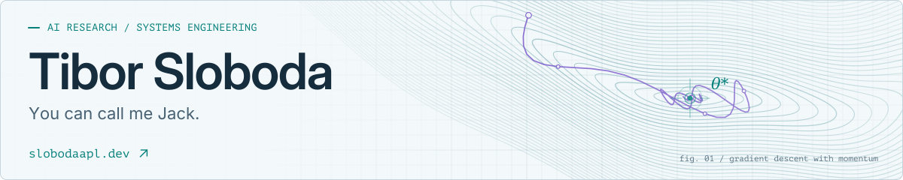
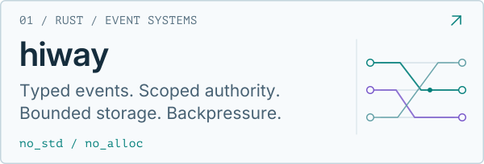
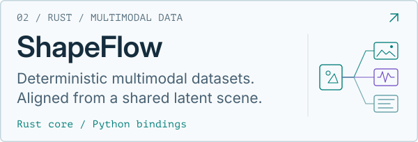
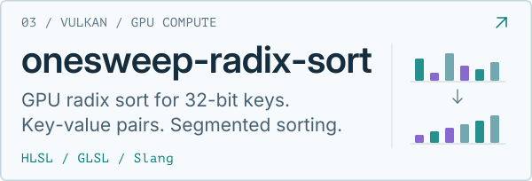
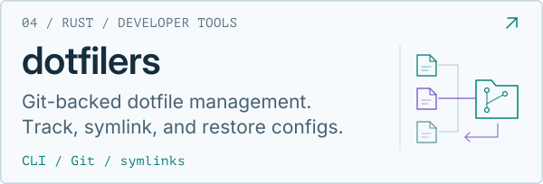

<a href="https://slobodaapl.dev">
  <picture>
    <source media="(max-width: 500px) and (prefers-color-scheme: dark)" srcset="./assets/hero-dark-mobile.svg">
    <source media="(max-width: 500px)" srcset="./assets/hero-light-mobile.svg">
    <source media="(prefers-color-scheme: dark)" srcset="./assets/hero-dark.svg">
    
  </picture>
</a>

  <a href="https://slobodaapl.dev"><strong>Website</strong></a> &nbsp; · &nbsp;
  <a href="https://slobodaapl.dev/research">Research</a> &nbsp; · &nbsp;
  <a href="https://aleph0.ai">aleph0</a> &nbsp; · &nbsp;
  <a href="mailto:slobodaapl@gmail.com">Contact</a>

I build agent systems, AI infrastructure, and research software. Founder of **[aleph0](https://aleph0.ai)**.  
Mostly **Rust** and **Python**. Private, sovereign AI, heterogeneous compute, and formal methods.

<picture>
  <source media="(max-width: 500px) and (prefers-color-scheme: dark)" srcset="./assets/section-dark-mobile.svg">
  <source media="(max-width: 500px)" srcset="./assets/section-light-mobile.svg">
  <source media="(prefers-color-scheme: dark)" srcset="./assets/section-dark.svg">
  
</picture>

  <a href="https://github.com/slobodaapl/hiway">
    <picture>
      <source media="(max-width: 500px) and (prefers-color-scheme: dark)" srcset="./assets/hiway-dark-mobile.svg">
      <source media="(max-width: 500px)" srcset="./assets/hiway-light-mobile.svg">
      <source media="(prefers-color-scheme: dark)" srcset="./assets/hiway-dark.svg">
      
    </picture>
  </a>
  <a href="https://github.com/aleph0-ai/shapeflow">
    <picture>
      <source media="(max-width: 500px) and (prefers-color-scheme: dark)" srcset="./assets/shapeflow-dark-mobile.svg">
      <source media="(max-width: 500px)" srcset="./assets/shapeflow-light-mobile.svg">
      <source media="(prefers-color-scheme: dark)" srcset="./assets/shapeflow-dark.svg">
      
    </picture>
  </a>

  <a href="https://github.com/slobodaapl/onesweep-radix-sort">
    <picture>
      <source media="(max-width: 500px) and (prefers-color-scheme: dark)" srcset="./assets/onesweep-radix-sort-dark-mobile.svg">
      <source media="(max-width: 500px)" srcset="./assets/onesweep-radix-sort-light-mobile.svg">
      <source media="(prefers-color-scheme: dark)" srcset="./assets/onesweep-radix-sort-dark.svg">
      
    </picture>
  </a>
  <a href="https://github.com/slobodaapl/dotfilers">
    <picture>
      <source media="(max-width: 500px) and (prefers-color-scheme: dark)" srcset="./assets/dotfilers-dark-mobile.svg">
      <source media="(max-width: 500px)" srcset="./assets/dotfilers-light-mobile.svg">
      <source media="(prefers-color-scheme: dark)" srcset="./assets/dotfilers-dark.svg">
      
    </picture>
  </a>

  
🔥 The campfire is still here.

  Medicine, physics, mathematics, sci-fi, board games, TTRPGs, and video games. Still curious about far too many things.

  Stay awhile, and rest your weary mind.

